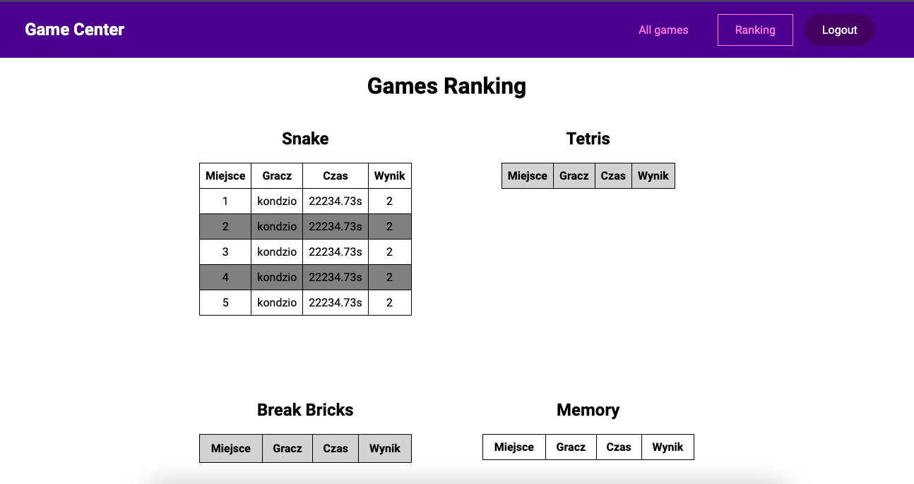
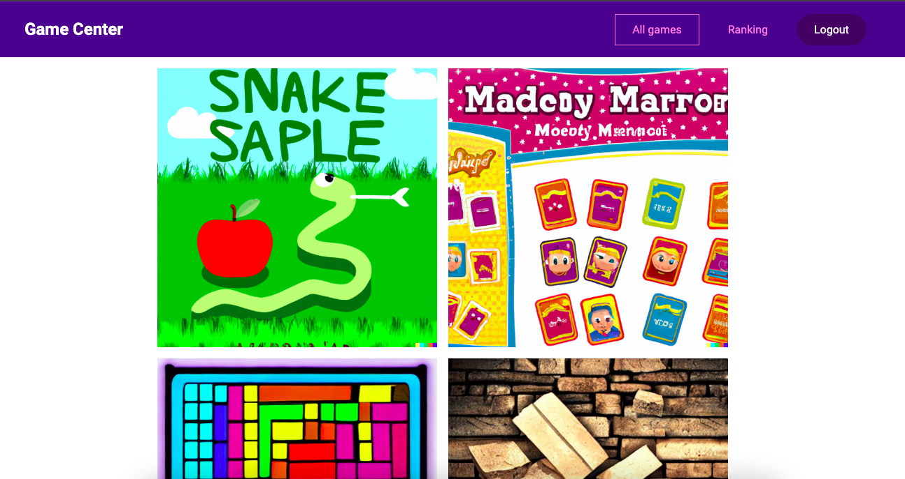
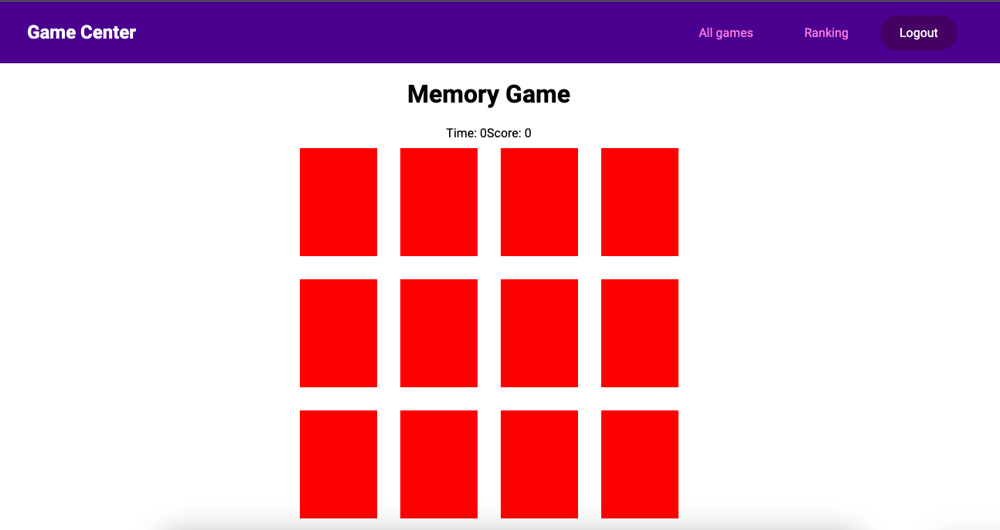
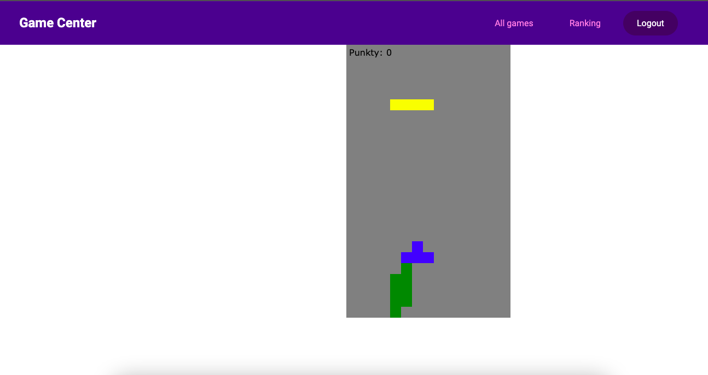
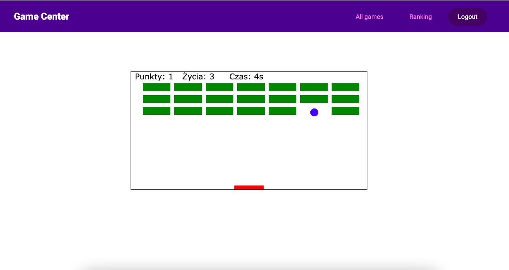
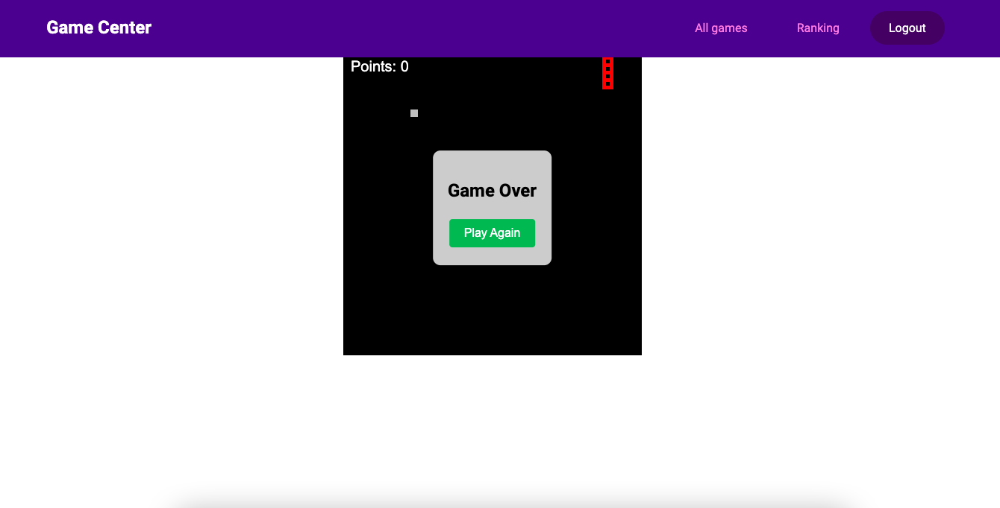

<h1>Game Center</h1>

A modern gaming platform built with Vue, Vuex, Canva, Pixi, and JSX.

<h2>Features</h2>
<ul>
  <li>Four engaging games: Snake, Tetris, Break Brics, and Memory.</li>
  <li>User authentication system with registration and login capabilities.</li>
  <li>Leaderboard page featuring overall high scores and individual player's best times.</li>
</ul>

<h2>Technology Stack</h2>
<ul>
  <li>Vue.js - A progressive JavaScript framework for building user interfaces.</li>
  <li>Vuex - A state management library for Vue.js applications.</li>
  <li>Canva - A graphic design platform used for creating visuals.</li>
  <li>Pixi.js - A 2D rendering library that works with WebGL and Canvas.</li>
  <li>JSX - A JavaScript syntax extension that allows writing HTML-like structures within JavaScript code.</li>
</ul>

<h2>Design Patterns</h2>

This project utilizes modern design patterns, such as the Strategy pattern in <code>auth/actions.js</code>.

<h2>Project Structure</h2>

The Game Center is built using Vue.js Option API, which provides a clear and organized structure for your components.

<h2>Why Recruiters Will Love This Project</h2>
<ul>
  <li>Demonstrates proficiency in modern web technologies like Vue.js, Vuex, and JSX.</li>
  <li>Utilizes advanced design patterns, such as the Strategy pattern, for efficient and scalable code.</li>
  <li>Features a polished and engaging user interface, showcasing design skills.</li>
  <li>Incorporates user authentication, demonstrating an understanding of security best practices.</li>
  <li>Includes a leaderboard system that fosters friendly competition and enhances user experience.</li>
</ul>

<h3>Screenshots</h3>

  
  
  
  
  
  

